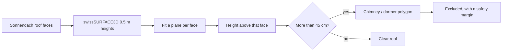
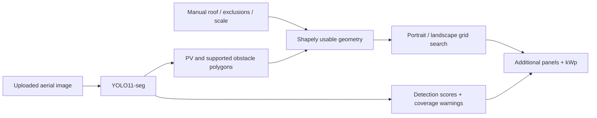

# SolarFit ☀️

### How many more solar panels actually fit on this roof? 

Not "roof area ÷ panel area". SolarFit lays out **real rectangular panels** on **your real roof**, around your chimneys, your skylights and the panels you already have — and tells you how many more you can genuinely fit. 

**Click a house on the map. Get an answer in seconds.**


*Generated from real API output, not a mockup.*

---

## Why it's different

| Most estimators | SolarFit |
|---|---|
| Divide roof area by panel area | Searches actual panel layouts, portrait **and** landscape, 16 grid offsets each |
| Guess the scale from a screenshot | Uses Switzerland's official map projection — **every metre is a real metre** |
| Treat a roof as one clean rectangle | Merges all of a building's roof planes, then cuts out obstacles, edges and existing PV |
| Ignore what is standing on the roof | **Measures chimneys and dormers** from Switzerland's 0.5 m height model and keeps panels clear of them |
| Send your images to a cloud API | **Runs entirely on your computer.** Nothing is uploaded or stored |
| Quote a confident single number | Shows Conservative / Recommended / Maximum, and says plainly what it does not know |

Built for the [AI for Accurate Rooftop PV Potential](https://www.energydatahackdays.ch/challenges/ai-for-accurate-rooftop-pv-potential) challenge, Energy Data Hackdays 2026.

---

## Set it up

Three steps. You only do this once.

### 1. Install the two things it needs

| | Download | Notes |
|---|---|---|
| **Python 3.11 or 3.12** | [python.org/downloads](https://www.python.org/downloads/) | On the first install screen, **tick "Add python.exe to PATH"**. Not 3.13 — the launcher looks for 3.11 or 3.12 specifically |
| **Node.js 22 or newer** | [nodejs.org](https://nodejs.org) | Take the "LTS" button and click Next through the installer |

An NVIDIA graphics card makes the AI faster but is **not** required — without one it uses your CPU and still works.

### 2. Get SolarFit onto your computer

Green **Code** button at the top of this page → **Download ZIP** → right-click the file → **Extract All**.

Or, if you have Git:

```powershell
git clone https://github.com/Aboss3b13/AI-for-Accurate-Rooftop-PV-Potential-Energy-Hackathon-
```

### 3. Double-click `START_SOLARFIT.bat`

That's the whole setup. The first run installs everything by itself — a virtual environment, the AI libraries and the web interface. It downloads **several gigabytes** (PyTorch with CUDA is most of it), so it needs internet and can easily take half an hour on a normal connection. Leave it alone until it finishes.

When it's ready your browser opens at **http://127.0.0.1:8000** and you can [start clicking roofs](#how-to-use-it).

**Every run after that starts in seconds** — no downloads. The AI runs entirely on your machine; only the aerial map needs internet.

> Keep the black console window open while you use SolarFit — that window *is* the app. Press Ctrl+C in it, or just close it, to stop.

### If something goes wrong

| It says | Do this |
|---|---|
| `Install Node.js 22 or newer` | Node isn't installed, or you didn't restart after installing. Close the window, install Node, open it again |
| `Install Python 3.11 or 3.12 with the Python launcher` | Reinstall Python and **tick "Add python.exe to PATH"** |
| Windows blocks the `.bat` file | Right-click it → **Properties** → tick **Unblock** → OK |
| The setup stops partway | Check your internet and double-click `START_SOLARFIT.bat` again — it picks up where it left off |
| The page loads but the map is blank | The map needs internet. The AI itself runs offline, but the aerial photos are downloaded live |
| Nothing happens after you change the code | Run `REBUILD_SOLARFIT.bat` |

The console window keeps the full error text on screen — it waits for a keypress instead of closing, so you can read it. On macOS or Linux there is no `.bat` launcher; follow [Development](#development) instead.

---

## How to use it

### The fast way — click a roof

1. Search a Swiss address, or drag the map to the building.
2. Zoom in until you can see individual roofs.
3. **Click the roof.** That's it.

SolarFit pulls Switzerland's official roof map, merges **every roof plane of that building** into one outline, downloads that patch of aerial photo at a known scale, finds existing solar panels, and calculates the layout — automatically.

Clicked building has several faces? They're outlined on the map. Click one to analyse just that face; click it again to go back to the whole roof.

### The flexible way — draw it yourself

Press **Draw it myself**, then click each corner of the roof on the photo. **Undo point** removes the last corner, **Clear drawing** wipes it, and **Use this outline** runs the analysis.

Use this when the building isn't in the official map, when you only want part of a roof, or when you simply disagree with the automatic outline.

### Either way, you can then

- Drag the outline's corners to correct it.
- Mark chimneys, skylights and vents the AI missed (**Obstacle**), or panels it missed (**Existing PV**).
- Switch between **Conservative**, **Recommended** and **Maximum** packing.
- Enter your own panel size and wattage from an installer's quote.
- Export everything as JSON.

> **Every setting in the app has a "?" next to it.** Click it for a plain-language explanation of what it means and what a normal value looks like.

### Your own image instead

Prefer a screenshot? **Upload roof**, draw the outline, then use **Scale** to click both ends of something whose length you know and type that length — otherwise the app has no idea how big anything is, and it will say so.

---

## What the numbers mean

| Number | In plain words |
|---|---|
| **Additional solar panels** | How many *more* panels fit, on top of any already there |
| **kWp** | Power at full sunshine — the figure installers quote. A Swiss house is typically 5–15 kWp |
| **Roof area** | The roof seen from above, in m². A pitched roof is a little larger in reality |
| **Usable area** | What's left after removing obstacles, existing panels and safety gaps |
| **Roof covered by new panels** | Share of the roof the new panels physically cover. Real roofs rarely pass ~80% |
| **Selected orientation** | Whether portrait or landscape fitted more panels |
| **Detection confidence** | How sure the AI is about what it *saw* — not whether the roof suits solar |

---

## How it finds chimneys

There is no chimney detector to train — the Swiss training masks label solar panels and nothing else. So SolarFit measures instead of guessing.

swisstopo publishes **swissSURFACE3D**, a national height model of the visible surface at one point every 50 cm. SolarFit downloads the tile under your roof, and for **each roof face separately** fits a plane through the height readings. Anything rising more than 45 cm above its own face is a structure standing on the roof.

Fitting per face is what makes it work on a pitched roof: a gable is metres higher at the ridge than the eaves, so a single height threshold would flag half the building. Measured against its own slope, a 30° pitch is flat — and the chimney on it still sticks out.



Structures under 2.5 m² are labelled chimneys, larger ones dormers. Ridge cells are excluded from the test, since a cell straddling two faces stands proud of both and would otherwise weld every chimney into one blob. Tiles are cached in `.cache/dsm`, so a second roof in the same square kilometre needs no download.

Measured across eight Swiss towns, this removes **2–14% of roof area** and cuts the panel count by 10–35% against the same roofs with obstacles ignored. Check it yourself:

```powershell
.venv/Scripts/python.exe scripts/check_obstacles.py
```

```text
place         roof m2  found  chim  blocked m2      %  tallest
Zurich          430.1      6     3        30.5    7.1  3.6 m
Winterthur      354.0      2     0        26.2    7.4  2.0 m
Bern            728.4      6     2       100.0   13.7  5.9 m
Brugg           236.4      2     1         5.5    2.3  2.5 m
```

If the height model cannot be reached, the app says so and carries on without it.

---

## Read this before trusting a number

SolarFit is an **honest estimate, not an installation plan.**

- **Flush features are invisible.** Chimneys, dormers and rooflight kerbs are measured from the height model, but a roof window set level into the pitch does not stand proud of the roof, so nothing detects it. Mark those by hand.
- **It errs towards blocking.** Without labelled ground truth the detector is tuned to flag rather than miss, so it removes roof area a surveyor might keep. Expect a slightly low panel count, not a high one.
- **The AI itself only knows solar panels.** The shipped model was trained on Swiss data labelling PV only. Obstacles come from the height model and from you, not from the image model.
- **Trees count as obstacles.** The height model records the surface, vegetation included, so a branch overhanging the roof is excluded like any other obstruction. That is usually what you want; it is not always what you expect.
- **The height model has its own date.** It, the roof map and the aerial photo are three separate surveys and may disagree about a recent building.
- **It is a flat, top-down calculation.** Roof pitch, shadows, snow, wind load, structural capacity, fire access, cabling and local setback rules are **not** modelled.
- **Safety margins are assumptions**, not your municipality's rules.
- **Aerial photos age.** The roof map and the photo may be from different years.

Have an installer confirm anything you plan to build.

---

## Checking it still works

`scripts/sanity_check.py` runs the whole pipeline — automatic *and* hand-drawn — against real houses sampled live from the Sonnendach roof layer in eight Swiss towns, and fails if any result is impossible:

```powershell
.venv/Scripts/python.exe scripts/sanity_check.py
```

```text
place             mode       planes  roof m2   usable  panels     kWp   use%
Winterthur        automatic       2    354.0    329.6     143   64.35   80.7
Bern Laenggasse   automatic      35    728.4    541.4     195   87.75   53.5
Lausanne          automatic       2    327.8    299.6     114   51.30   69.5
Brugg             automatic       1    236.4    209.5      84   37.80   71.0
```

Unit tests: `.venv/Scripts/python.exe -m pytest -q`

---

## What is implemented

- React + TypeScript + Vite dashboard with responsive SVG drawing and overlays.
- FastAPI image upload and validated pixel-coordinate polygons.
- Custom YOLO11-seg inference; supported classes: existing PV, chimney, skylight, other obstacle, optional dormer. Incomplete class coverage is disclosed.
- Shapely exclusion geometry, including holes, concave and disconnected usable regions.
- Portrait and landscape grid search with **4 × 4 offsets each**; configurable module size, power, gap and roof alignment. Every accepted panel must be fully covered by the usable polygon. Non-overlapping grid steps enforce panel separation.
- Configurable roof-edge / obstacle / existing-PV margins: default 0.30 / 0.40 / 0.20 m, multiplied by 1.5 / 1 / 0.5 across modes.
- CUDA mixed-precision inference, CPU fallback, bounded inference cache, model hot reload, optional SAM refinement.
- Detection confidence summary with uncertain-object warnings. No invented overall certainty or individual-module count from installation masks.
- Optional annual energy only when the user supplies a specific yield in kWh/kWp.
- Training-data conversion, geographic splitting, training, evaluation, and geometry/API tests.



YOLO11-seg provides compact GPU-friendly instance segmentation. Masks follow installation shapes more closely than bounding boxes, which would exclude empty corners and distort remaining space. The nano baseline favours this laptop’s latency; the training script defaults to the small variant for further refinement.

## Model and accuracy

See [model card](models/MODEL_CARD.md) and [evaluation](models/evaluation.json) for the shipped baseline’s actual training and measured mask performance. It is a hackathon baseline, not a validated installation-planning system. **The Swiss source masks label PV installations only; they cannot teach a chimney/skylight detector.** Rather than train on data that does not exist, obstacles are measured from the swissSURFACE3D height model — see [How it finds chimneys](#how-it-finds-chimneys). Flush features still need manual exclusion, and the UI says so.

If the checkpoint is absent or fails, the app keeps the geometric workflow available and reports AI as unavailable. It never treats generic COCO weights or sample annotations as rooftop AI predictions. Detected PV counts are **regions**, not individual modules.

### Configuration

Copy `.env.example` to `.env` if needed. Default model: `models/rooftop_best.pt`. See [training instructions](training/README.md) to replace it. Never load untrusted `.pt` files.

Optional SAM: set `USE_SAM_REFINEMENT=true` and supply a compatible SAM checkpoint at `SAM_MODEL_PATH`; the installed Ultralytics package provides the adapter. Missing/failed refinement falls back to original YOLO masks with a warning. No SAM weights are downloaded automatically. Automatic roof detection has a provider interface; the working MVP uses manual roof boundaries.

## Development

From the repository root, after first setup:

```powershell
.venv/Scripts/python.exe -m uvicorn backend.main:app --reload --host 127.0.0.1 --port 8000
```

In another terminal:

```powershell
cd frontend
npm ci
npm run dev
```

Vite proxies `/api` to FastAPI. Production builds are served by FastAPI itself, so the batch launcher needs only one server process. API documentation: http://127.0.0.1:8000/docs.

Browsers implementing the experimental document-scoped WebMCP registry can read completed results with `read_solarfit_analysis`. This is optional and feature-detected; no compatible WebMCP validation context was available during implementation.

```powershell
.venv/Scripts/python.exe -m pytest -q
cd frontend
npm run build
```

### API

`POST /api/analyse`: multipart `image` plus `settings` JSON. Roof and object polygons use **original image pixels after EXIF orientation**. Supply `roof`, optional `objects`, `pixels_per_metre`, `scale_verified`, `mode`, `panel`, `angle` and margin values. See [typed schemas](backend/schemas/analysis.py). `GET /api/health` reports model availability. Geometry returns as GeoJSON, still in image pixels, not a geographic CRS.

### Structure

```text
frontend/src/           Dashboard, typed responses, SVG editing
backend/main.py        Upload API and production frontend serving
backend/schemas/       Validated inputs
backend/services/      YOLO, SAM, geometry, packing, confidence, energy,
                       Swiss map lookup and height-model obstacle detection
models/                Baseline checkpoint, model card, evaluation
training/              Data conversion, training and evaluation
scripts/               Windows setup, launcher, example bundling,
                       sanity_check.py and check_obstacles.py
tests/                 Geometry, packing and API regression tests
START_SOLARFIT.bat      One-click local start
TRAIN_MODEL.bat        Separate optional training run
```

## Practical limitations and next steps

This is a **2D projected-roof estimate**. Roof pitch, multiple planes, shadows, setback regulations, wind loads, structural capacity, fire access, string design and electrical interconnection are not modelled. Trace each roof plane separately. Screen perspective, map zoom, low resolution, occlusion and inaccurate scale can materially change counts. Safety defaults are assumptions, not local regulatory rules.

The search selects the best tested regular grid, not the mathematical global optimum; it does not mix portrait/landscape modules within one layout. Mode results are recalculated, not hardcoded, and need not be perfectly monotonic under a finite offset search. Suggested counts should be reviewed by an installer.

Detection scores are uncalibrated model confidences and do not measure probability that a roof is safe or that every obstacle was found. Capacity accuracy needs measured roof and installation ground truth, which this dataset does not supply. Annual energy is omitted without user-provided yield data.

Next: annotate roof obstacles, add roof-plane segmentation, larger regional test sets, multi-scale inference, pitch/shadow modelling, and Sonnendach-sourced yield with provenance. No external solar API, cloud hosting or upload storage is required by this local prototype.

## Sources and licensing

- [Challenge brief](https://www.energydatahackdays.ch/challenges/ai-for-accurate-rooftop-pv-potential)
- [Swiss dataset by Jean Perbet](https://www.kaggle.com/datasets/jeanprbt/swiss-solar-panels-segmentation) (Kaggle-listed CC0; imagery attribution retained)
- [Original EPFL project](https://github.com/jeanprbt/swiss-solar-panel-segmentation)
- [Ultralytics YOLO11](https://docs.ultralytics.com/models/yolo11/) and [segmentation documentation](https://docs.ultralytics.com/tasks/segment/)

SolarFit source is distributed under AGPL-3.0; Ultralytics software and model usage is subject to its AGPL-3.0 / commercial licensing terms. See `LICENSE` and preserve third-party notices.
