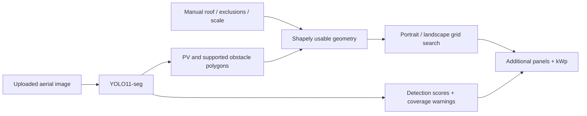

# SolarFit ☀️

**How many more solar panels can physically fit on this roof?**

A local hackathon prototype for [AI for Accurate Rooftop PV Potential](https://www.energydatahackdays.ch/challenges/ai-for-accurate-rooftop-pv-potential), Energy Data Hackdays 2026.

SolarFit combines aerial-image segmentation, roof geometry, configurable clearance assumptions and physical module packing to estimate **additional panels and kWp**. It searches actual rectangular layouts instead of dividing roof area by panel area.


This illustration is generated from the real API output, not a website screenshot. Reproduce it with `scripts/verify_examples.py` while the server runs.

## Start on Windows

**Double-click `START_SOLARFIT.bat`.** It opens **http://127.0.0.1:8000** automatically. Keep its console open; Ctrl+C stops the server.

Prerequisites for a fresh machine: **Python 3.11 or 3.12** (with the `py` launcher), **Node.js 22+**, and an up-to-date NVIDIA driver for GPU use. First launch installs a virtual environment, CUDA-enabled PyTorch and the frontend build; this downloads several GB and needs internet. Subsequent launches use local files and work offline. CPU inference is supported when CUDA is unavailable. The setup uses PyTorch 2.10 / CUDA 12.8 and does not require a separate CUDA toolkit.

After updating source code, run `REBUILD_SOLARFIT.bat`. Dependencies and outputs are kept outside Git; source, lockfile, examples, scripts and the baseline model are tracked. Uploaded images are processed in memory, not sent to an external AI service or saved by the app. A small in-memory inference cache clears on restart.

## Try your satellite screenshot

1. Upload PNG, JPG, JPEG or WebP (20 MB / 25 MP maximum). Crop closely to **one roof plane**, using a top-down image with clear details.
2. Choose **Roof**, click around its boundary, then click **Finish** or the first point. Enter also closes a polygon; Escape cancels. Use **Edit** to drag its vertices.
3. Choose **Scale**, click two endpoints of a known distance, and enter metres. Alternatively enter pixels/metre or approximate roof width. Approximate scale is clearly flagged.
4. Mark visible obstacles and missed existing PV. Manual exclusions are editable by removing and redrawing them. The baseline detector covers **PV only**, so obstacle marking is required for a meaningful result.
5. Click **Analyse roof**. Toggle the roof, existing PV, obstacle, safety, usable-area and proposed-module layers. **View original** hides the analysis overlay.
6. Compare Conservative / Recommended / Maximum. Panel dimensions, wattage, alignment and margins automatically trigger a recalculation after the first run; AI detections are cached.
7. Export geometry, detections, capacity, warnings and statistics as JSON.

Three bundled real Swiss aerial crops include prepared roof outlines; the obstacle example has explicitly manual obstacle marks. They are interaction examples, not capacity-validation ground truth. [Imagery attribution](frontend/public/examples/ATTRIBUTION.md).

## What is implemented

- React + TypeScript + Vite dashboard with responsive SVG drawing and overlays.
- FastAPI image upload and validated pixel-coordinate polygons.
- Custom YOLO11-seg inference; supported classes: existing PV, chimney, skylight, other obstacle, optional dormer. Incomplete class coverage is disclosed.
- Shapely exclusion geometry, including holes, concave and disconnected usable regions.
- Portrait and landscape grid search with **4 × 4 offsets each**; configurable module size, power, gap and roof alignment. Every accepted panel must be fully covered by the usable polygon. Non-overlapping grid steps enforce panel separation.
- Configurable roof-edge / obstacle / existing-PV margins: default 0.30 / 0.40 / 0.20 m, multiplied by 1.5 / 1 / 0.5 across modes.
- CUDA mixed-precision inference, CPU fallback, bounded inference cache, model hot reload, optional SAM refinement.
- Detection confidence summary with uncertain-object warnings. No invented overall certainty or individual-module count from installation masks.
- Optional annual energy only when the user supplies a specific yield in kWh/kWp.
- Training-data conversion, geographic splitting, training, evaluation, and geometry/API tests.



YOLO11-seg provides compact GPU-friendly instance segmentation. Masks follow installation shapes more closely than bounding boxes, which would exclude empty corners and distort remaining space. The nano baseline favours this laptop’s latency; the training script defaults to the small variant for further refinement.

## Model and accuracy

See [model card](models/MODEL_CARD.md) and [evaluation](models/evaluation.json) for the shipped baseline’s actual training and measured mask performance. It is a hackathon baseline, not a validated installation-planning system. **The Swiss source masks label PV installations only; they cannot teach a chimney/skylight detector.** The UI and backend disclose that missing coverage. Use manual exclusions until you train a fully annotated obstacle model.

If the checkpoint is absent or fails, the app keeps the geometric workflow available and reports AI as unavailable. It never treats generic COCO weights or sample annotations as rooftop AI predictions. Detected PV counts are **regions**, not individual modules.

### Configuration

Copy `.env.example` to `.env` if needed. Default model: `models/rooftop_best.pt`. See [training instructions](training/README.md) to replace it. Never load untrusted `.pt` files.

Optional SAM: set `USE_SAM_REFINEMENT=true` and supply a compatible SAM checkpoint at `SAM_MODEL_PATH`; the installed Ultralytics package provides the adapter. Missing/failed refinement falls back to original YOLO masks with a warning. No SAM weights are downloaded automatically. Automatic roof detection has a provider interface; the working MVP uses manual roof boundaries.

## Development

From the repository root, after first setup:

```powershell
.venv/Scripts/python.exe -m uvicorn backend.main:app --reload --host 127.0.0.1 --port 8000
```

In another terminal:

```powershell
cd frontend
npm ci
npm run dev
```

Vite proxies `/api` to FastAPI. Production builds are served by FastAPI itself, so the batch launcher needs only one server process. API documentation: http://127.0.0.1:8000/docs.

Browsers implementing the experimental document-scoped WebMCP registry can read completed results with `read_solarfit_analysis`. This is optional and feature-detected; no compatible WebMCP validation context was available during implementation.

```powershell
.venv/Scripts/python.exe -m pytest -q
cd frontend
npm run build
```

### API

`POST /api/analyse`: multipart `image` plus `settings` JSON. Roof and object polygons use **original image pixels after EXIF orientation**. Supply `roof`, optional `objects`, `pixels_per_metre`, `scale_verified`, `mode`, `panel`, `angle` and margin values. See [typed schemas](backend/schemas/analysis.py). `GET /api/health` reports model availability. Geometry returns as GeoJSON, still in image pixels, not a geographic CRS.

### Structure

```text
frontend/src/           Dashboard, typed responses, SVG editing
backend/main.py        Upload API and production frontend serving
backend/schemas/       Validated inputs
backend/services/      YOLO, SAM, geometry, packing, confidence, energy
models/                Baseline checkpoint, model card, evaluation
training/              Data conversion, training and evaluation
scripts/               Windows setup, launcher, example bundling
tests/                 Geometry, packing and API regression tests
START_SOLARFIT.bat      One-click local start
TRAIN_MODEL.bat        Separate optional training run
```

## Practical limitations and next steps

This is a **2D projected-roof estimate**. Roof pitch, multiple planes, shadows, setback regulations, wind loads, structural capacity, fire access, string design and electrical interconnection are not modelled. Trace each roof plane separately. Screen perspective, map zoom, low resolution, occlusion and inaccurate scale can materially change counts. Safety defaults are assumptions, not local regulatory rules.

The search selects the best tested regular grid, not the mathematical global optimum; it does not mix portrait/landscape modules within one layout. Mode results are recalculated, not hardcoded, and need not be perfectly monotonic under a finite offset search. Suggested counts should be reviewed by an installer.

Detection scores are uncalibrated model confidences and do not measure probability that a roof is safe or that every obstacle was found. Capacity accuracy needs measured roof and installation ground truth, which this dataset does not supply. Annual energy is omitted without user-provided yield data.

Next: annotate roof obstacles, add roof-plane segmentation, larger regional test sets, multi-scale inference, pitch/shadow modelling, and Sonnendach-sourced yield with provenance. No external solar API, cloud hosting or upload storage is required by this local prototype.

## Sources and licensing

- [Challenge brief](https://www.energydatahackdays.ch/challenges/ai-for-accurate-rooftop-pv-potential)
- [Swiss dataset by Jean Perbet](https://www.kaggle.com/datasets/jeanprbt/swiss-solar-panels-segmentation) (Kaggle-listed CC0; imagery attribution retained)
- [Original EPFL project](https://github.com/jeanprbt/swiss-solar-panel-segmentation)
- [Ultralytics YOLO11](https://docs.ultralytics.com/models/yolo11/) and [segmentation documentation](https://docs.ultralytics.com/tasks/segment/)

SolarFit source is distributed under AGPL-3.0; Ultralytics software and model usage is subject to its AGPL-3.0 / commercial licensing terms. See `LICENSE` and preserve third-party notices.
