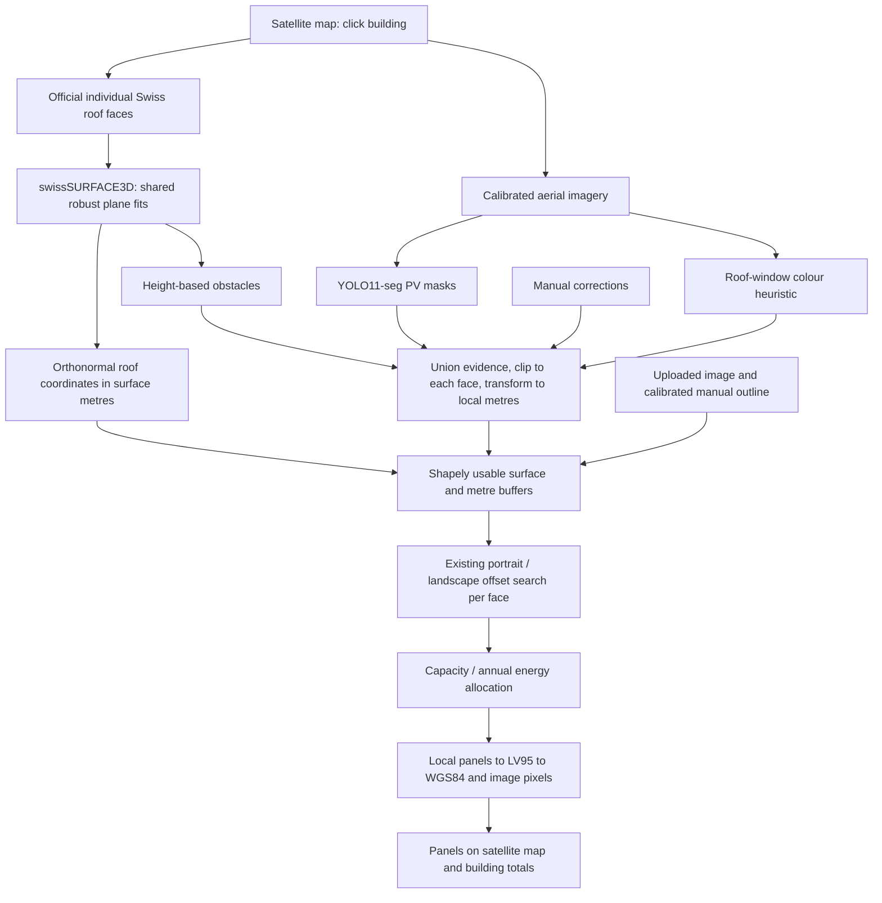
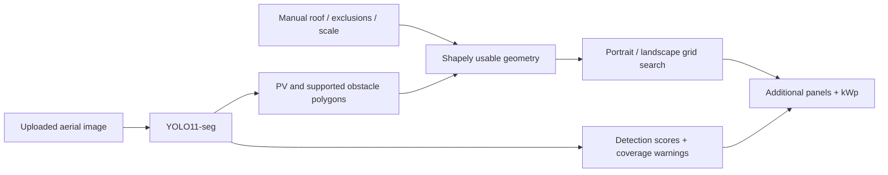

# SolarFit ☀️

### How many more solar panels actually fit on this roof? 

Not "roof area ÷ panel area". SolarFit lays out **real rectangular panels** on **your real roof**, around your chimneys, your skylights and the panels you already have — and tells you how many more you can genuinely fit. 

**Click a house on the map. Get an answer in seconds.**


*Generated from real API output, not a mockup.*

---

## The challenge, and how SolarFit answers it

> Sonnendach estimates rooftop PV potential, but it does not account for panels
> already installed, chimneys, skylights, dormers or other obstacles. Solutions
> should provide **more realistic estimates of installable rooftop solar capacity**.
> — [Energy Data Hackdays: AI for Accurate Rooftop PV Potential](https://www.energydatahackdays.ch/challenges/ai-for-accurate-rooftop-pv-potential)

| What the challenge asks | Where SolarFit does it |
|---|---|
| Analyse swisstopo aerial imagery with computer vision | YOLO11-seg on the live SWISSIMAGE capture, plus a colour rule for roof windows |
| Detect **existing PV** | Trained on Swiss PV masks; existing arrays are excluded from the new layout |
| Segment **rooftop obstacles** | Chimneys and dormers measured from swissSURFACE3D; roof windows from the photo |
| Subtract them from Sonnendach's potential | Every face is screened, then obstacles, shade and margins are removed |
| Produce a **realistic installable capacity** | Real modules are packed into what is left, and reported in kWp and kWh/year |

The result distinguishes **Sonnendach theoretical roof potential** (inclined roof
area and source-model annual yield) from **SolarFit additional potential** (new
modules, kWp and estimated annual production). These have different definitions;
a percentage difference is not an accuracy improvement or installation approval.
The area breakdown explains occupancy, screening and unused surface under the
selected planning settings.

### Research recommendations implemented

Existing features include official roof-face geometry, robust DSM fitting with
adaptive residual thresholds, PV detection, rooflight heuristics, manual edits,
EGID/PV-register corroboration, survey dates, input confidence and local shade
screening. Annual energy continues to use Sonnendach irradiation without applying
a second shade multiplier.

The performance ratio is configurable (default **0.80**) in advanced settings.
A supplied specific yield overrides it. Energy is panel count times module kWp
times annual irradiation times performance ratio; zero irradiation gives zero energy.

Use **Mark smoke / heat exhaust (RWA)** for a confirmed exhaust opening. Its
**2 m advisory clearance** remains in every packing mode, including Maximum,
and can exclude space on neighbouring faces. Ordinary skylights are not inferred
to be exhaust openings. This implements the simple clearance approach in
[VKF 2001-15, 2022 edition, appendix page 14](https://services.vkg.ch/rest/public/georg/bs/publikation/documents/BSPUB-1394520214-197.pdf/content).
Alternative opening envelopes, snow conditions and site applicability need review.
The result and JSON export distinguish effective installer margins from this
advisory rule and list unassessed requirements. They do not certify compliance.

Validation: 137 automated backend tests and the frontend HTTP regression test pass, including panel clearance across packing
modes, neighbouring-space exclusions, energy assumptions and physical-preview
area accounting. The production frontend builds successfully. These checks do
not establish real-roof detection precision/recall: a geographically separated,
reviewed reference set is still needed for empirical accuracy claims.

The roof editor now includes **Explore local shadows**, with a representative
date and half-hour UTC slider. It reuses cached DSM horizons and leaves annual
energy unchanged. Run `python -m scripts.benchmark_roofs` for fixed-roof placement
checks, measured first-pass/warm timings and offline result snapshots, and
`python -m training.evaluate_pixels` for held-out PV pixel IoU/F1/recall.
See the [implementation evidence and demo runbook](docs/research-implementation.md)
for measured results, limitations and optional CPU Docker deployment.

Whole-roof selection now follows connected roof sections across Sonnendach
building IDs. It retains separate faces for fitting, excludes detached nearby
roofs, and respects different known EGIDs. Where identity is missing, a shared
roof edge is used and the result asks you to verify attached structures; this
does not determine legal land-property boundaries. The Suhr screenshot regression
now captures approximately 259 m² across 12 faces, rather than 106 m² across four.

PV detection uses a full-image pass plus overlapping crops for captures larger
than 768 pixels, merging repeated masks before exclusions. This retains detail
for small arrays without retraining; accuracy gains still need labelled evaluation.
Local shadows now sample roof surfaces down to 0.5 m, use 2.5-degree directional
bins, and sample obstacles every 0.5 m within 20 m. Results include each panel's
3D corners and roof normal alongside its 2D projection; absolute coordinates are
unknown when roof height is unavailable. Annual production retains official
shading-aware irradiation, without applying a second shadow multiplier.

## Why it's different

| Most estimators | SolarFit |
|---|---|
| Divide roof area by panel area | Searches actual panel layouts, portrait **and** landscape, 16 grid offsets each |
| Guess the scale from a screenshot | Uses Switzerland's official map projection — **every metre is a real metre** |
| Treat a roof as one clean rectangle | Fits each roof face in 3D, packs modules in surface metres, then maps them back onto the aerial image |
| Ignore what is standing on the roof | **Measures chimneys and dormers** from Switzerland's 0.5 m height model, and **spots roof windows** by their reflection in the photo |
| Send your images to a cloud API | **Runs entirely on your computer.** Nothing is uploaded or stored |
| Quote a confident single number | Shows Conservative / Recommended / Maximum, and says plainly what it does not know |

Built for the [AI for Accurate Rooftop PV Potential](https://www.energydatahackdays.ch/challenges/ai-for-accurate-rooftop-pv-potential) challenge, Energy Data Hackdays 2026.

---

## Try it without installing anything

A live instance is tunnelled at
**<https://bernadette-nonfeeling-transparently.ngrok-free.dev>** while the
machine hosting it is running. ngrok's free tier shows a one-off warning page
first; click *Visit Site*. Run `START_SOLARFIT_NGROK.bat` to publish your own.

---

## Set it up

Three steps. You only do this once.

### 1. Install the two things it needs

| | Download | Notes |
|---|---|---|
| **Python 3.11 or 3.12** | [python.org/downloads](https://www.python.org/downloads/) | On the first install screen, **tick "Add python.exe to PATH"**. Not 3.13 — the launcher looks for 3.11 or 3.12 specifically |
| **Node.js 22 or newer** | [nodejs.org](https://nodejs.org) | Take the "LTS" button and click Next through the installer |

An NVIDIA graphics card makes the AI faster but is **not** required — without one it uses your CPU and still works.

### 2. Get SolarFit onto your computer

Green **Code** button at the top of this page → **Download ZIP** → right-click the file → **Extract All**.

Or, if you have Git:

```powershell
git clone https://github.com/Aboss3b13/AI-for-Accurate-Rooftop-PV-Potential-Energy-Hackathon-
```

### 3. Double-click `START_SOLARFIT.bat`

That's the whole setup. The first run installs everything by itself — a virtual environment, the AI libraries and the web interface. It downloads **several gigabytes** (PyTorch with CUDA is most of it), so it needs internet and can easily take half an hour on a normal connection. Leave it alone until it finishes.

When it's ready your browser opens at **http://127.0.0.1:8000** and you can [start clicking roofs](#how-to-use-it).

**Later starts reuse the installed environment.** The launcher automatically rebuilds updated frontend source. Map imagery and geodata need internet; AI runs locally.

> Keep the black console window open while you use SolarFit — that window *is* the app. Press Ctrl+C in it, or just close it, to stop.

### Share through ngrok

Double-click **`START_SOLARFIT_NGROK.bat`**. It starts the same production app on port 8000, reuses an existing tunnel when possible, and opens its HTTPS URL. The normal `START_SOLARFIT.bat` remains available for local use.

This installation uses **https://bernadette-nonfeeling-transparently.ngrok-free.dev/**. If setting up another computer/account, install ngrok and configure your own authtoken once using ngrok's setup instructions. Set `SOLARFIT_PUBLIC_URL` in `.env` to your assigned domain. Tokens are never stored in this repository. An equivalent manual command, after starting SolarFit, is:

```powershell
ngrok http --url=https://bernadette-nonfeeling-transparently.ngrok-free.dev http://127.0.0.1:8000
```

Keep the app and tunnel running. The frontend and `/api` use the same origin, so remote visitors do not call their own localhost and no Vite host bypass is needed. Ngrok's free-tier browser notice may appear on a first visit; continue through it. AI still runs on this computer; the tunnel forwards visitors' requests to it.

### If something goes wrong

| It says | Do this |
|---|---|
| `Install Node.js 22 or newer` | Node isn't installed, or you didn't restart after installing. Close the window, install Node, open it again |
| `Install Python 3.11 or 3.12 with the Python launcher` | Reinstall Python and **tick "Add python.exe to PATH"** |
| Windows blocks the `.bat` file | Right-click it → **Properties** → tick **Unblock** → OK |
| The setup stops partway | Check your internet and double-click `START_SOLARFIT.bat` again — it picks up where it left off |
| The page loads but the map is blank | The map needs internet. The AI itself runs offline, but the aerial photos are downloaded live |
| Changes are not showing | Just start `START_SOLARFIT.bat` again — it closes the older backend itself and rebuilds changed frontend code; `REBUILD_SOLARFIT.bat` also refreshes setup |
| `Port 8000 is held by another application` | Something that is **not** SolarFit has the port. The launcher will not close other people's programs, so close it yourself and start again |

Starting SolarFit twice is fine: the launcher checks port 8000, and if an older
SolarFit backend is there it **closes that one first**. A browser reload cannot
replace a running backend, so this is done for you. Anything on the port that is
not SolarFit is left alone and reported instead.

The console window keeps the full error text on screen — it waits for a keypress instead of closing, so you can read it. On macOS or Linux there is no `.bat` launcher; follow [Development](#development) instead.

---

## How to use it

### The fast way — click a roof

1. Search a Swiss address, or drag the map to the building.
2. Zoom in until you can see individual roofs.
3. **Click the roof.** That's it.
4. When analysis finishes, SolarFit automatically opens the aerial picture in **Roof editor**, with proposed panels and analysis overlays ready to review and adjust.

SolarFit retrieves **individual official roof faces**, fits their planes from swissSURFACE3D, downloads a calibrated aerial patch, finds existing PV and obstacles, and packs each face in **true roof-surface metres**. The completed result opens as a picture in the roof editor. You can switch back to **Satellite map** to see the same proposed modules over the live map or select another building. A merged outline is retained only for overview/editing; it is never the packing surface.

All faces are analysed in one click. Select a face on the map or in **Inspect** to see its pitch, compass azimuth, projected/surface area, usable space, PV regions, obstacles, panels and capacity. Inspection reuses the completed result; it does not download or run AI again. Choose **Whole building** to see the total.

### The flexible way — draw it yourself

Press **Draw it myself**, then click each corner of the roof on the photo. **Undo point** removes the last corner, **Clear drawing** wipes it, and **Use this outline** runs the analysis.

Use this when the building isn't in the official map, when you only want part of a roof, or when you simply disagree with the automatic outline.

### Either way, you can then

- Select a face and press **Adjust this face**, then drag its outline in the existing editor. Corrections retain the other faces. A whole-building boundary edit crops the official faces; to extend beyond them, draw a separate map roof.
- Mark chimneys, skylights and vents the AI missed (**Obstacle**), or panels it missed (**Existing PV**).
- Switch between **Conservative**, **Recommended** and **Maximum** packing.
- Enter your own panel size and wattage from an installer's quote.
- Export everything as JSON.

> **Every setting in the app has a "?" next to it.** Click it for a plain-language explanation of what it means and what a normal value looks like.

### Your own image instead

Prefer a screenshot? **Upload roof**, draw the outline, then use **Scale** to click both ends of something whose length you know and type that length — otherwise the app has no idea how big anything is, and it will say so.

### Logical placement, shade and whether more panels are needed

Map analyses now default to **sunlight and practical-array screening**. The editor shows a building assessment and per-face reasons, not just a capacity number. It checks official roof dimensions, pitch, orientation and irradiation; existing PV and obstacles; and nearby buildings, trees and terrain from the DSM. Poorly suited faces and heavily shaded regions can produce **zero** recommended panels. The physical capacity before screening is shown separately.

The prototype's default rules exclude unknown/conflicting geometry, pitch above 65 degrees, annual irradiation below 800 kWh/m², sampled direct-sun access below 60%, and isolated groups smaller than four modules. Calculated surface area is checked against the published roof area, with discrepancies above 20% requiring review. These are explicit screening choices, not building regulations or a profitability guarantee. Turn off **Screen for sunlight and practical panel groups** to inspect the physical-fit preview; this is clearly labelled as not an installation recommendation.

The purple **Seasonal shade risk** layer shows roof cells below the sunlight threshold. Rays inspect the DSM within 120 m in 5-degree directions. Solar position follows [NOAA's equations](https://gml.noaa.gov/grad/solcalc/solareqns.PDF), sampled every half hour on twelve representative days. Per-face annual and winter direct-sun access describe geometric exposure, not annual electricity loss. Missing height coverage is **unknown**, never automatically clear. Raster resolution, fixed vegetation, source dates and the 120 m radius limit the analysis; distant terrain and climate are represented by official irradiation where available. SolarFit does not multiply the existing shaded irradiation by this score, which would count shading twice.

Under **Size to electricity use**, enter annual electricity consumption and existing annual PV production (0 if none). Both are needed: existing PV masks cannot reveal actual production. The layout then targets the remaining annual energy demand, preferring higher-yield faces while retaining practical groups. If the entered existing production already meets that annual target, no additional modules are proposed for it. Without those inputs, the app says that demand is unknown. Annual balance is not hourly self-sufficiency, and surplus export may still be a separate goal.

The assessment also lists what remains unverified: snow/wind and structural loads, roof condition, grid connection, ownership, tariffs, installation cost and payback. Those factors cannot be established from aerial geometry alone.

---

## What the numbers mean

| Number | In plain words |
|---|---|
| **Additional solar panels** | How many *more* panels fit, on top of any already there |
| **kWp** | Power at full sunshine — the figure installers quote. A Swiss house is typically 5–15 kWp |
| **Roof surface area** | Sum of physical face areas; unreliable faces contribute their labelled projected fallback area |
| **Projected area** | Top-down footprint, shown separately from physical surface |
| **Usable area** | What's left after removing obstacles, existing panels and safety gaps |
| **Roof covered by new panels** | Share of the roof the new panels physically cover. Real roofs rarely pass ~80% |
| **Selected orientation** | Whether portrait or landscape fitted more panels |
| **Detection confidence** | How sure the AI is about what it *saw* — not whether the roof suits solar |

---

## Which roof is *this* roof?

The building's extent is **measured**, not inferred from a record group.

When you click, SolarFit streams the swissBUILDINGS3D tile over that point,
decodes the building solids, and takes the footprint of the one under your
click. Sonnendach's faces are then **clipped to that footprint** — they keep
their shape and their solar record, but they no longer decide how far the
building reaches.

```text
click
 → swissBUILDINGS3D tile (~136 KB, 2026)   → footprint + roof surfaces + EGID
 → Sonnendach faces clipped to it          → irradiation, suitability
 → swissSURFACE3D                          → plane fit, obstacles, shade
 → aerial image                            → existing PV, flush rooflights
```

**Streamed, not downloaded.** The bulk swissBUILDINGS3D distribution is not
usable interactively: the CityGML tile over the test area is **251 MB** and
dated 2019. The same model is published as 3D Tiles, where the tile over one
city block is **136 KB** and dated **2026-05-20**. Tiles are cached on disk
under a 300 MB budget, so a second building in the same block costs nothing.

A tile is a batched glTF with Draco-compressed triangles, a batch id per vertex
and a batch table carrying **EGID**, roof heights and building use — so the
building is identified by the same federal identifier Sonnendach and the plant
register use.

Positions reach LV95 through the transform the 3D Tiles specification
prescribes: node TRS, then y-up to z-up, then the tile's `RTC_CENTER`, then
ECEF. Getting that order wrong still lands in the right city, so it is checked
against the batch table's own `DACH_MAX` — the two agree to **within a
centimetre per building**.

Roof surfaces are grouped from the triangles by plane, and only the **topmost**
surface at each point of the plan counts: a solid carries balconies, terraces
and floor slabs as well as its roof, and summed blindly one building reported
294% of its own footprint as roof.

### Why Sonnendach still packs the panels

The measured surfaces are accurate but finely triangulated, and packing each
fragment separately charges an edge setback to boundaries that are not edges.
Doing that cost one block **199 of its 199 modules**. So the measured model sets
the **boundary and identity**, and the official faces — clipped to it — remain
the packing surfaces. Across nine Zurich buildings the panel counts hold
(203 vs 199, 472 vs 456, 29 vs 29) while the outline now follows the physical
building, including curved ends that no Sonnendach polygon reproduces.

### If the 3D model is unavailable

Every failure falls through, in this order, with the degradation recorded in
the result:

1. swissBUILDINGS3D extent + Sonnendach faces + swissSURFACE3D validation
2. Sonnendach faces joined by the connectivity graph + swissSURFACE3D
3. Sonnendach faces alone
4. Draw the roof by hand on the map or on an uploaded image

### Faces that merely share an identifier


Sonnendach's `building_id` groups **records, not structures**. Two roofs either
side of a courtyard can carry the same one. SolarFit used to seed its selection
with every face sharing the clicked face's id and then only ever add to it, so
an unrelated polygon was in before any geometry was consulted and nothing could
take it back out.

The identifier is now a source of **candidates only**. Faces form a graph, the
traversal starts at the face under your click, and a face joins when geometry
says it is attached — a shared edge of real length, or genuine overlap. A
passing corner is not attachment, and neither is proximity.

```text
A -- B -- C -- D          X          (all four share one building_id)
     ^ clicked                        X is not attached to anything

kept:    A B C D
dropped: X   "no physical connection to the clicked roof"
```

Where measured elevation is available it gets a veto: the strip between two
faces is sampled against swissALTI3D terrain, and a join is withdrawn if there
is no building standing between them. Faces with a different EGID are never
absorbed.

On a real Wiedikon building this drops **5 of 19** candidate polygons, all of
them carrying `building_id` 533408, taking the analysed roof from 225 m² to the
196 m² actually under the click. Every candidate keeps its reason, and the
result panel lists them, because "why is this roof part of my building?" has to
be answerable.

### What decides what

| Question | Decided by |
|---|---|
| Which faces are candidates | Sonnendach `building_id` near the click |
| **Which faces are the physical roof** | **Geometry: shared-edge graph from the clicked face** |
| Whether a join is real | swissSURFACE3D against swissALTI3D terrain |
| Roof plane, slope, azimuth, true area | swissSURFACE3D consensus fit, per face |
| Irradiation and solar suitability | Sonnendach |
| Existing PV, flush rooflights | Aerial imagery |
| Everything else | Deterministic geometry |

Calculations stay **per face** in that face's own surface metres. The merged
outline exists for the map only.

**swissBUILDINGS3D is deliberately not fetched per click.** Its CityGML tile
over the test area is **251 MB** and dated 2019, against 13 MB and 2024 for the
surface model, and swisstopo states that dormers and small roof details are not
modelled in it. It would cost the interactive budget without answering the
question. swissSURFACE3D measures the roof as it stands, which is what the
connectivity check needs.

---

## Why predict what Switzerland already measured?

Most of the answer is not predicted. Switzerland publishes the roof, the
irradiation, the surface, the terrain and the installations, so those are
looked up rather than guessed. Geometry and sun position are calculated. The
vision model is kept for the two things nobody records.

| Question | Answered by | How |
|---|---|---|
| Roof outline, pitch, orientation | Sonnendach, height-validated | **Measured** |
| Annual irradiation, incl. horizon shading | Sonnendach `mstrahlung` | **Measured** |
| Chimneys, dormers, plant rooms | swissSURFACE3D at 0.5 m | **Measured** |
| Ground inside the roof outline | swissSURFACE3D − swissALTI3D | **Measured** |
| Does this building already have PV? | SFOE plant register, matched on EGID | **Measured** |
| Sun position and local shading | NOAA solar geometry + DSM rays | **Calculated** |
| How many modules physically fit | Grid search over real rectangles | **Calculated** |
| **Where** the existing array sits | Segmentation on the aerial image | *Inferred* |
| Flush roof windows | Reflection contrast in the image | *Inferred* |

The result panel carries this table for the roof you are looking at, so the
strength of every number is visible rather than implied.

### Five sources, five survey dates

None of these datasets was surveyed on the same day. swisstopo flies imagery
and the height model on multi-year cycles, the plant register updates monthly,
and Sonnendach carries its own revision date. Two perfectly correct sources can
therefore describe different buildings.

Every analysis now reports the age of what it used:

```text
Aerial 2025 · Height model 2024 · Roof record 2021-12-03 · Plant register monthly
```

One disagreement actually costs a user money, so it is checked explicitly: an
array commissioned **after** the aerial survey cannot appear in it. The detector
is not wrong to miss it, and the roof is not as empty as the photograph makes it
look.

```text
Register:  installation commissioned 2021
Imagery:   survey year 2019
→ "An installation registered in 2021 is newer than the 2019 aerial survey,
   so it cannot appear in this image (25.5 kW). Treat the roof as more
   occupied than the photograph shows."
```

Sources more than three years apart are flagged too, and so is imagery old
enough that recent building work would be invisible.

### Shade on every face that can carry it

Shade screening needs to know how high a roof sits, not how well its slope was
recovered. The strict test — twelve height cells, forty per cent of them within
35 cm of the deck — was refusing small and noisy faces, and those faces were
then packed with **no shade screening at all**, which is worse than an
approximate answer. Measured over five Zurich roofs, that was 41 of 114 faces.

A face that fails the strict test now takes an approximate anchor from the
median of its own height samples, and says so: the result carries the anchor
quality, and the face gains a caution rather than silently looking certain.

```text
shade analysis on faces      64%  ->  80%
                             (73 measured, 18 approximate)
```

Faces with fewer than six height samples are still refused outright. An
approximate answer is worth having; an invented one is not.

### Confidence per input, not one headline number

There is no single accuracy figure for a result assembled from measurements,
calculations and one inference, so none is invented. Each input carries its own:

| Input | Level | Why |
|---|---|---|
| Roof geometry | High | Official Sonnendach faces |
| Roof-plane fit | High | Fitted to the 0.5 m height model |
| Aerial freshness | Varies | From the tile's own survey year |
| Existing PV presence | High / Low | Register entry, or none — and absence proves little |
| Existing PV position | **Medium, always** | No dataset records where panels sit |
| Raised structures | High | Measured against each face's own plane |
| Flush rooflights | Medium | Colour heuristic; no height signal exists |
| Local shading | Medium | Static height model, not an hourly simulation |
| Structural capacity | Not assessed | Needs construction details |
| Regulatory compliance | Not assessed | Clearances are planning assumptions |

Existing PV position can never be high, whatever the model reports, because
nothing measures it.

### The register and the image check each other

The [SFOE register of electricity production plants](https://www.bfe.admin.ch/fr/installations-production-electrique)
is keyed by the federal building identifier, and Sonnendach carries the same
identifier for every roof face, so the two join exactly. The register gives
capacity, commissioning date and mounting type as recorded fact.

It gives **capacity, never position** — it will say a 25.5 kW array exists, not
which part of the roof it covers. So it does not replace the vision model; it
audits it, and it catches the failure the model is worst at:

```text
Register:  1 installation, 25.5 kW        (Bubenbergstrasse, Zurich)
Image:     0 arrays found on this roof
→ "The federal register lists PV on this building (25.5 kW), but none was
   found on it in the image. Mark the existing array, or modules may be
   proposed where panels already stand."
```

That is a real building, and a real miss by the detector, surfaced by official
data instead of going unnoticed.

The check runs the other way too. Panels found on a roof with no register entry
are reported as expected rather than contradictory, because the register only
covers the guarantee-of-origin system: **absence is weak evidence**, so it is
reported as unknown, never as none.

### What is deliberately not claimed

swissBUILDINGS3D would give true 3D roof surfaces, but swisstopo states that
smaller roof details and dormers are generally not modelled, so it would not
remove the need for the surface model or the image. Setback and fire-access
rules vary by canton, municipality, building type and heritage status, so the
clearances here are **configurable planning assumptions**, not a compliance
check.

---

## How it finds obstacles

There is no chimney detector to train — the Swiss training masks label solar panels and nothing else. So SolarFit measures instead of guessing.

swisstopo publishes **swissSURFACE3D**, a national height model of the visible surface at one point every 50 cm. SolarFit downloads the tile under your roof, and for **each roof face separately** fits a plane through the height readings. Anything rising more than 28 cm above its own face is a structure standing on the roof.

Fitting per face is what makes it work on a pitched roof: a gable is metres higher at the ridge than the eaves, so a single height threshold would flag half the building. Measured against its own slope, a 30° pitch is flat — and the chimney on it still sticks out.



SolarFit does not use AI to guess geometry that official Swiss geodata can provide. Official geodata defines the physical roof. Computer vision identifies what currently occupies it. A geometric optimiser then determines how many real modules can physically fit.

### Physical roof geometry

`roof_plane.py` provides an orthonormal basis `(u, v, normal)` anchored near each face in LV95 metres. **Official Sonnendach pitch and azimuth define the surface when valid**, rather than flattening the roof when a DSM fit fails. Interior DSM samples robustly anchor its absolute LN02 height and check agreement. Strong discrepancies are flagged for review. Without official angles, the existing robust DSM fit remains available: it needs enough points, full rank, deck RMSE at most 0.25 m and pitch below 75 degrees. Samples use 0.5 m cell centres, preferably at least 0.5 m inside the face. These are prototype quality gates, not survey certification.

World XY points are lifted to their fitted plane and expressed as local `(u, v)` metres. Surface area is calculated from that polygon; `projected_area / cos(pitch)` provides an independent check. Existing `build_usable` and `optimise_panels` run with scale **1**, so panel sizes, gaps and buffers are all measured along the roof. Panel corners are then transformed back to LV95, WGS84 for Leaflet, and pixels for the retained image editor. The grid alignment control applies an offset from each face's automatic alignment.

Disconnected faces stay in the capture and result. Overlapping projections are assigned to the higher fitted face before packing to prevent panels under another roof. Detections crossing a ridge are clipped into each face. Overlapping evidence is unioned, with PV classification taking precedence over a reflection-only skylight guess; contributing sources remain in the export. Detection regions are not individual installed-module counts.

If neither official angles nor a reliable DSM plane are available, the face keeps **projected 2D geometry** for physical previews and is withheld from recommended placement. A valid official plane can still be used without absolute height, but nearby shading is then unverified. Uploads remain calibrated 2D. A hand-drawn map outline is treated as one face: draw different pitches separately. Edits reuse the original plane and sunlight samples; extending onto a different physical surface requires a fresh map selection.

### Energy objectives

Both objectives operate after suitability screening. **Maximum capacity** fills eligible layouts. **Maximum annual energy** prioritises higher-yield faces under a panel limit. Without a limit or demand target, both use the same eligible space. An entered annual demand target also limits the layout and prioritises yield. Comparison cards show actual allocations, not illustrative numbers.

Sonnendach `mstrahlung` is annual face-average irradiation in kWh/m^2, not electrical yield. SolarFit derives a planning yield as `mstrahlung * 0.80` kWh/kWp/year, using the performance ratio in the [official BFE data model, pp. 11-12](https://pubdb.bfe.admin.ch/fr/publication/download/9665). New annual electricity is `new kWp * specific yield`. The selected module's rating determines capacity. Face-average irradiation includes the source model's shading, while the local shadow preview remains separate from annual electricity and electrical losses. A user-supplied yield overrides this estimate for all faces. No irradiation means no invented energy value. Suitability classes and irradiation can also be inspected as a map layer.

### Caching and diagnostics

Official lookup responses and aerial patches are cached for one hour; roof fits and capture contexts for two hours, with bounded entry counts. DSM tiles retain the existing 2 GB disk cache. The existing bounded YOLO cache reuses inference when image bytes match. Changing packing settings only recomputes geometry/layouts. Capture IDs are tied to the decoded image and map scale; expired captures ask for a fresh click instead of using the wrong geometry. Restarting the backend clears process-local caches.

Append `?debug=1` to the local URL to expose a collapsible diagnostics view. JSON exports always include each face's sample/inlier counts, fit coefficients/RMSE, normal and axes, 4x4 forward/inverse transforms, height-source tiles, fallback reason, projected/surface/usable areas, local exclusions, candidate layouts/panels tested and selected panels.


Structures under 2.5 m² are labelled chimneys, larger ones dormers. Ridge cells are excluded from the test, since a cell straddling two faces stands proud of both and would otherwise weld every chimney into one blob. Tiles are cached in `.cache/dsm`, so a second roof in the same square kilometre needs no download.

Measured across eight Swiss towns, this removes **2–14% of roof area** and cuts the panel count by 10–35% against the same roofs with obstacles ignored. Check it yourself:

```powershell
.venv/Scripts/python.exe scripts/check_obstacles.py
```

```text
place         roof m2  found  chim  blocked m2      %  tallest
Zurich          430.1      6     3        30.5    7.1  3.6 m
Winterthur      354.0      2     0        26.2    7.4  2.0 m
Bern            728.4      6     2       100.0   13.7  5.9 m
Brugg           236.4      2     1         5.5    2.3  2.5 m
```

If the height model cannot be reached, the app says so and carries on without it.

### Existing arrays: colour, because the model missed them

The trained checkpoint scores well on its own test split and still missed large
arrays on real captures. On a Binzstrasse warehouse whose roof is half covered
in modules it returned three small patches, and **396 new modules were proposed
straight on top of the existing array**.

Silicon under anti-reflective coating is strongly blue where clay, concrete,
gravel and bitumen are red- or brown-dominant, so an array separates from its
own roof on the blue-minus-red axis. The split is found with Otsu rather than a
fixed cut, and unlike the rooflight test it is made against the whole roof: an
array is metres across, and a local background subtraction cancels exactly the
large uniform regions being looked for.

```text
Binzstrasse warehouse    before          after
existing PV found        259 m²          1,822 m²
modules proposed         396             259
```

Otsu always splits, so the result is only believed when three things hold: the
bright class is blue in **absolute** terms (+18, where a plain roof's bluer half
sits near zero), the two classes are genuinely distinct, and each region is a
**compact, textured block**. Modules carry cell and frame lines, so an array is
never smoother than its roof — that rejects blue-grey sheeting — and a real
array is solid, which rejects the bluish parapet band that a flat Oerlikon roof
otherwise offered up as a 74 m² "array".

**Shade is never reported as an array.** A component markedly darker than its
own roof is refused unless it is blue in absolute terms, which shade is not.
This matters more than it sounds: a shaded half of a roof returned as existing
PV does not merely mislabel it, it removes that roof from the estimate.

The cost is deliberate and worth stating. An all-black array on a clay roof is
also dark and also not absolutely blue, and nothing in a single aerial frame
separates the two reliably. That case is left to the trained model and to
manual marking rather than guessed at from brightness.

A roof that is *all* array is the hard case, and the first version failed it
completely. Otsu still splits, but into brighter and darker modules rather than
array against roof: on a region that is nothing but modules the two classes lie
11 apart, the separation guard reads that as "no array here", and every module
is missed. When even the darker class is array-blue the whole blue field is
taken instead, and texture and solidity still have to agree. That region went
from **0 to 658 of 744 m²**.

It is a colour rule, not a trained detector, and it is used **alongside** the
model rather than instead of it. On a sawtooth roof the north-light glazing is
blue too and gets included: excluded from the layout either way, but labelled
as PV rather than as glazing.

### Roof windows: the half the height model cannot see

A roof window sits flush in the pitch. It rises above nothing, so no height model will ever find it — and on the Zurich roof above there are twenty of them.

The photo does show them. Glass reflects the sky, so a rooflight is **blue** where clay, concrete and bitumen are all red- or brown-dominant. On that roof the tiles measure about −18 on the blue-minus-red axis and the windows +20 to +32.

The test is made against the roof immediately around each pixel rather than the building as a whole, because one merged roof spans sunlit and shaded faces and that spread swamps any fixed cut. A candidate then has to be the size of a window (0.25–6 m²), roughly rectangular, and away from the roof edge where flashing and gutters are also bluish.

```powershell
.venv/Scripts/python.exe scripts/check_rooflights.py
```

```text
place             roof m2  windows  raised  blocked m2      %
Zurich (yours)      627.3       20       6        42.8    6.8
Winterthur          354.0        7       3        41.4   11.7
Brugg               236.4        6       4        52.2   22.1
```

This is a colour rule, not a trained detector, and the README says so because it matters: it will miss a window in deep shadow and can be fooled by a blue-grey roof. Look at the overlay.

---

## Tested across Zurich

`scripts/zurich_survey.py` samples a real building in each of ten Zurich
districts, runs the whole pipeline, and writes a rendered overlay per roof so
the layout can be checked by eye rather than by summary statistics.

```powershell
.venv/Scripts/python.exe scripts/zurich_survey.py out/
```

```text
district              m2 faces  pan    kWp   obs  win  screened  short%
01 Altstadt          236     2   58   26.1     1    1         0    44.5
03 Wiedikon          225    19    0    0.0     5    1        91   100.0
04 Aussersihl       1677    54  209   94.0    29   14       261    70.3
05 Industrie        2817     6  412  185.4    32   24       358    80.4
06 Unterstrass       621    15   84   37.8     7    4        30    69.6
07 Hottingen         228     3   23   10.3    10    9         0    76.6
08 Seefeld           558    27    0    0.0    13   10       325   100.0
09 Altstetten        228     7   29   13.1     1    1        67    63.2
11 Oerlikon          296     2   92   41.4     4    2         0    29.6
```

That survey found three real defects, all now fixed and covered by tests:

- **A crash.** Projecting a face's outline back through its own plane can leave
  a ring that touches itself, and GEOS then threw a side-location conflict
  mid-union — a 500 on the 2,817 m² industrial roof. Geometry is repaired with
  `make_valid` before unioning, not `buffer(0)`, which resolves a self-touching
  ring by discarding a lobe and would have quietly lost real roof area.
- **Narrow strips fitting nothing.** Sonnendach splits one plane by sub-area,
  so a villa arrived as 6.5 × 1.61 m strips at 1244 kWh/m². Packed separately
  each is charged a full edge setback on a boundary that is not an edge,
  leaving 0.71 m — less than a module. Touching faces that share an
  orientation are now joined first.
- **A regression that fix caused.** Joining faces by pitch and aspect alone
  welded two levels of a stepped flat roof into a plane that exists nowhere,
  and the industrial roof went from 412 modules to none. Flat faces are no
  longer joined: at pitch zero, matching aspect says nothing about height.

Two roofs still report zero, and that is the honest answer rather than a bug.
Seefeld is a villa under heavy tree cover: 47 modules would physically fit, but
once shade screening removes the cells that are dark for most of the day, no
connected group of four survives. The result panel now says exactly that
instead of showing a bare zero.

---

## Lining the geometry up with the photograph

SWISSIMAGE is orthorectified against the **terrain, not against buildings**, so
a building leans away from the point the camera was over. Its roof is drawn a
metre or two from where its coordinates put it, and the gap grows with height.

That is not cosmetic. The roof outline, chimneys and terrain exclusions come
from map coordinates, while existing arrays and rooflights are found in the
image. Left uncorrected, each set is applied to the wrong part of the other's
roof — and the outline drawn on screen sits off the building.

Every capture is therefore aligned once: the roof outline is slid over the
image's own edges and kept where it sits on them best. Measured on real
captures, a Binzstrasse warehouse needs **2.8 m**, a Rümlang house **1.8 m**,
in different directions. The shift is folded into the capture's map/image
conversion, so both directions agree and detections land on the right roof.

The correction is refused rather than guessed when it cannot be trusted:

- when the outline already sits on the roof (no meaningful gain),
- when the best position lies against the wall of the search, since the real
  optimum is then further out,
- and when no position puts the outline on real structure — an outline over
  blank ground scores near zero, where any flicker of noise beats it by a wide
  ratio and the estimator would confidently align to nothing.

The applied shift is reported with the result.

---

## How the modules are laid out

A pitched roof and a flat roof are mounted differently, and the layout follows
that rather than filling every square metre the same way.

**On a pitched roof** modules lie flush against the slope, shoulder to shoulder
with a couple of centimetres between them. That block *is* the standard layout.

**On a flat roof** they sit on tilted racks, and a rack shades the one behind
it. Rows are therefore spaced by the shadow the design sun casts:

```text
gap = module length x sin(tilt) / tan(sun altitude)
```

At the default 15° tilt against the winter-solstice noon sun on the Swiss
plateau (19.2°), a 1.76 m module occupies **1.70 m** of roof and needs **1.31 m**
behind it — a row pitch of 3.01 m, nearly twice the module. Tilt, design sun
altitude and an explicit row gap are all configurable.

The module drawn on the map is the rack's **footprint**, not the module, because
a leaning module covers less roof than its own length.

This is not a cosmetic change. A flat Oerlikon roof previously packed **82**
modules edge to edge, which no installer could build; spaced properly it holds
**41**. Across ten cantons the flat-roof counts roughly halve and the pitched
ones are untouched.

---

## Read this before trusting a number

SolarFit is an **honest estimate, not an installation plan.**

- **Roof windows are inferred from colour**, not from a trained model. Glass reflecting the sky is a strong signal, but a blue-grey roof, wet patches or metal flashing can fool it, and a window in deep shadow can be missed. Check the overlay against the photo.
- **It errs towards blocking.** Without labelled ground truth the detector is tuned to flag rather than miss, so it removes roof area a surveyor might keep. Expect a slightly low panel count, not a high one.
- **The AI itself only knows solar panels.** The shipped model was trained on Swiss data labelling PV only. Obstacles come from the height model and from you, not from the image model.
- **Trees count as obstacles.** The height model records the surface, vegetation included, so a branch overhanging the roof is excluded like any other obstruction. That is usually what you want; it is not always what you expect.
- **The height model has its own date.** It, the roof map and the aerial photo are three separate surveys and may disagree about a recent building.
- **This is planning-level geometry.** Pitch and individual faces are modelled where DSM fits are reliable. Structural loads, hourly weather-dependent shading, electrical design and legal setback compliance are not assessed.
- **Safety margins are assumptions**, not your municipality's rules.
- **Aerial photos age.** The roof map and the photo may be from different years.

Have an installer confirm anything you plan to build.

---

## Checking it still works

`scripts/sanity_check.py` runs the whole pipeline — automatic *and* hand-drawn — against real houses sampled live from the Sonnendach roof layer in eight Swiss towns, and fails if any result is impossible:

```powershell
.venv/Scripts/python.exe scripts/sanity_check.py
```

```text
place             mode       planes  roof m2   usable  panels     kWp   use%
Winterthur        automatic       2    354.0    329.6     143   64.35   80.7
Bern Laenggasse   automatic      35    728.4    541.4     195   87.75   53.5
Lausanne          automatic       2    327.8    299.6     114   51.30   69.5
Brugg             automatic       1    236.4    209.5      84   37.80   71.0
```

The table above records the earlier projected-layout version, not the new surface optimiser.

Unit tests: `.venv/Scripts/python.exe -m pytest -q`

Live surface pipeline check: `.venv/Scripts/python.exe -m scripts.verify_surfaces`. It selects real roofs near Zurich, Bern and Brugg, runs the existing CUDA model, verifies surface area and panel containment, and checks deterministic warm-cache reuse. Local measurements are written to `.cache/surface-verification.json` (not committed).

---

## What is implemented

- React + TypeScript + Vite dashboard with responsive SVG drawing and overlays.
- FastAPI image upload and validated pixel-coordinate polygons.
- Custom YOLO11-seg inference; supported classes: existing PV, chimney, skylight, other obstacle, optional dormer. Incomplete class coverage is disclosed.
- Shapely exclusion geometry, including holes, concave and disconnected usable regions.
- Portrait and landscape grid search with **4 × 4 offsets each**; configurable module size, power, gap and roof alignment. Every accepted panel must be fully covered by the usable polygon. Non-overlapping grid steps enforce panel separation.
- Configurable roof-edge / obstacle / existing-PV margins: default 0.30 / 0.40 / 0.20 m, multiplied by 1.5 / 1 / 0.5 across modes.
- CUDA mixed-precision inference, CPU fallback, bounded inference cache, model hot reload, optional SAM refinement.
- Detection confidence summary with uncertain-object warnings. No invented overall certainty or individual-module count from installation masks.
- Per-face annual energy from official Sonnendach irradiation with a disclosed 80% performance ratio, or a user-supplied specific yield. Missing data disables the energy objective. An optional panel limit enables allocation to higher-yield faces.
- Training-data conversion, geographic splitting, training, evaluation, and geometry/API tests.



YOLO11-seg provides compact GPU-friendly instance segmentation. Masks follow installation shapes more closely than bounding boxes, which would exclude empty corners and distort remaining space. The nano baseline favours this laptop’s latency; the training script defaults to the small variant for further refinement.

## Model and accuracy

See [model card](models/MODEL_CARD.md) and [evaluation](models/evaluation.json) for the shipped baseline’s actual training and measured mask performance. It is a hackathon baseline, not a validated installation-planning system. **The Swiss source masks label PV installations only; they cannot teach a chimney/skylight detector.** Rather than train on data that does not exist, obstacles are measured from the swissSURFACE3D height model — see [How it finds chimneys](#how-it-finds-chimneys). Flush features still need manual exclusion, and the UI says so.

If the checkpoint is absent or fails, the app keeps the geometric workflow available and reports AI as unavailable. It never treats generic COCO weights or sample annotations as rooftop AI predictions. Detected PV counts are **regions**, not individual modules.

### Configuration

Copy `.env.example` to `.env` if needed. Default model: `models/rooftop_best.pt`. See [training instructions](training/README.md) to replace it. Never load untrusted `.pt` files.

Optional SAM: set `USE_SAM_REFINEMENT=true` and supply a compatible SAM checkpoint at `SAM_MODEL_PATH`; the installed Ultralytics package provides the adapter. Missing/failed refinement falls back to original YOLO masks with a warning. No SAM weights are downloaded automatically. Map mode uses official Sonnendach faces; uploaded images retain manual roof boundaries.

## Development

From the repository root, after first setup:

```powershell
.venv/Scripts/python.exe -m uvicorn backend.main:app --reload --host 127.0.0.1 --port 8000
```

In another terminal:

```powershell
cd frontend
npm ci
npm run dev
```

Vite proxies `/api` to FastAPI. Production builds are served by FastAPI itself, so the batch launcher needs only one server process. API documentation: http://127.0.0.1:8000/docs.

Browsers implementing the experimental document-scoped WebMCP registry can read completed results with `read_solarfit_analysis`. This is optional and feature-detected; no compatible WebMCP validation context was available during implementation.

```powershell
.venv/Scripts/python.exe -m pytest -q
cd frontend
npm run build
```

### API

`POST /api/analyse`: multipart `image` plus `settings` JSON. Roof and object polygons use **original image pixels after EXIF orientation**. Supply `roof`, optional `objects`, `pixels_per_metre`, `scale_verified`, `mode`, `panel`, `angle` and margin values. See [typed schemas](backend/schemas/analysis.py). `GET /api/health` reports model availability. Image-editor geometry returns in pixels. For map captures, send the `capture_id` from `POST /api/map/prepare`; the response additionally includes `faces` in local surface metres and `map_overlay` GeoJSON in WGS84 longitude/latitude. Optional `face_overrides` contain edited pixel rings keyed by face ID, `building_override` crops all faces, `objective` selects capacity/energy, and `max_panels` limits the new modules. `GET /api/map/search` provides Swiss address search.

### Structure

```text
frontend/src/           Dashboard, typed responses, SVG editing
backend/main.py        Upload API and production frontend serving
backend/schemas/       Validated inputs
backend/services/      YOLO, SAM, geometry, packing, confidence, energy,
                       Swiss map lookup, height-model and roof-window detection
models/                Baseline checkpoint, model card, evaluation
training/              Data conversion, training and evaluation
scripts/               Windows setup, launcher, example bundling, and the
                       sanity / obstacle / rooflight check scripts
tests/                 Geometry, packing and API regression tests
START_SOLARFIT.bat      One-click local start
TRAIN_MODEL.bat        Separate optional training run
```

## Practical limitations and next steps

This is a **planning estimate, not a construction plan**. Official geometry is not installation-survey precision; imagery, roof records and elevation may have different acquisition dates. Nearby shadows are sampled geometrically, not simulated with hourly weather or seasonal foliage. Structural loads, snow/wind, fire-code compliance, wiring and electrical interconnection are not assessed. Buffers are configurable planning assumptions. Flat-roof modules lie on the fitted surface; tilted rack spacing and mutual shading are not modelled. Uploaded images still depend on manual calibration and perspective.

The search selects the best tested regular grid, not the mathematical global optimum; it does not mix portrait/landscape modules within one layout. Mode results are recalculated, not hardcoded, and need not be perfectly monotonic under a finite offset search. Suggested counts should be reviewed by an installer.

Detection scores are uncalibrated model confidences and do not measure probability that a roof is safe or that every obstacle was found. Capacity accuracy needs measured roof and installation ground truth, which this dataset does not supply. Annual energy is omitted where neither official irradiation nor a supplied yield is available.

Next: labelled obstacle training data, larger regional validation sets, hourly radiation modelling and installation-survey comparisons. No external solar API, cloud hosting or upload storage is required by this local prototype.

## Sources and licensing

- [Challenge brief](https://www.energydatahackdays.ch/challenges/ai-for-accurate-rooftop-pv-potential)
- [Swiss dataset by Jean Perbet](https://www.kaggle.com/datasets/jeanprbt/swiss-solar-panels-segmentation) (Kaggle-listed CC0; imagery attribution retained)
- [Original EPFL project](https://github.com/jeanprbt/swiss-solar-panel-segmentation)
- [Ultralytics YOLO11](https://docs.ultralytics.com/models/yolo11/) and [segmentation documentation](https://docs.ultralytics.com/tasks/segment/)

SolarFit source is distributed under AGPL-3.0; Ultralytics software and model usage is subject to its AGPL-3.0 / commercial licensing terms. See `LICENSE` and preserve third-party notices.
