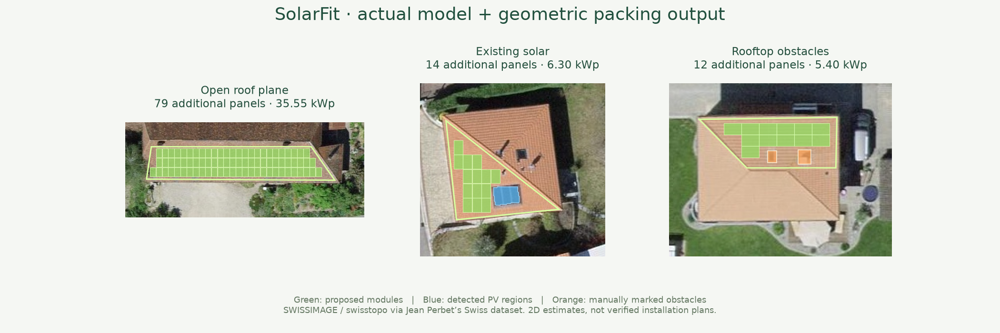
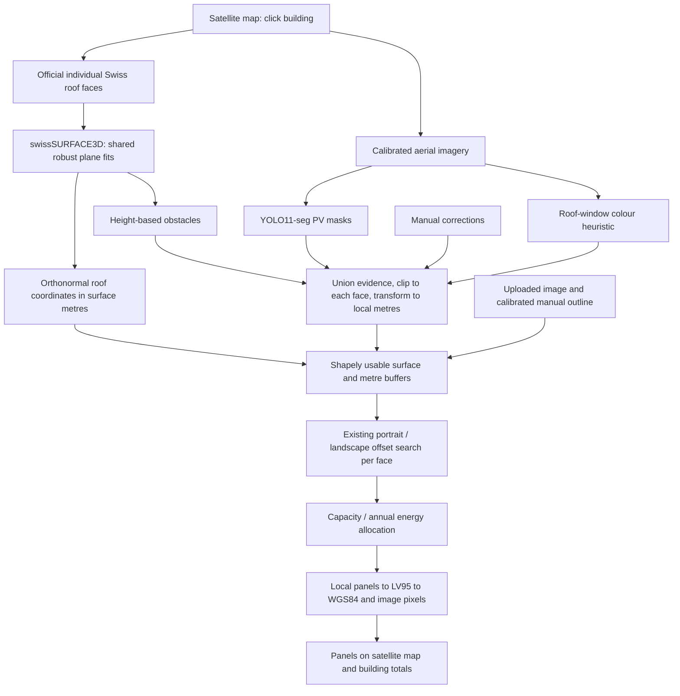
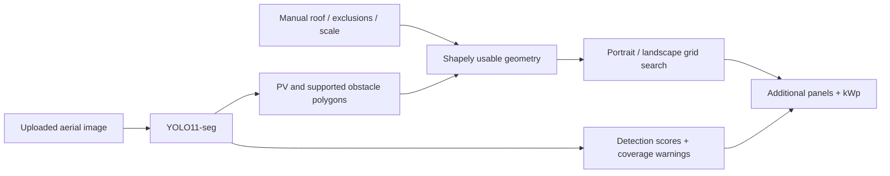

# SolarFit ☀️

### How many more solar panels actually fit on this roof? 

Not "roof area ÷ panel area". SolarFit lays out **real rectangular panels** on **your real roof**, around your chimneys, your skylights and the panels you already have — and tells you how many more you can genuinely fit. 

**Click a house on the map. Get an answer in seconds.**



*Generated from real API output, not a mockup.*

---

## Why it's different

| Most estimators | SolarFit |
|---|---|
| Divide roof area by panel area | Searches actual panel layouts, portrait **and** landscape, 16 grid offsets each |
| Guess the scale from a screenshot | Uses Switzerland's official map projection — **every metre is a real metre** |
| Treat a roof as one clean rectangle | Fits each roof face in 3D, packs modules in surface metres, then maps them back onto the aerial image |
| Ignore what is standing on the roof | **Measures chimneys and dormers** from Switzerland's 0.5 m height model, and **spots roof windows** by their reflection in the photo |
| Send your images to a cloud API | **Runs entirely on your computer.** Nothing is uploaded or stored |
| Quote a confident single number | Shows Conservative / Recommended / Maximum, and says plainly what it does not know |

Built for the [AI for Accurate Rooftop PV Potential](https://www.energydatahackdays.ch/challenges/ai-for-accurate-rooftop-pv-potential) challenge, Energy Data Hackdays 2026.

---

## Set it up

Three steps. You only do this once.

### 1. Install the two things it needs

| | Download | Notes |
|---|---|---|
| **Python 3.11 or 3.12** | [python.org/downloads](https://www.python.org/downloads/) | On the first install screen, **tick "Add python.exe to PATH"**. Not 3.13 — the launcher looks for 3.11 or 3.12 specifically |
| **Node.js 22 or newer** | [nodejs.org](https://nodejs.org) | Take the "LTS" button and click Next through the installer |

An NVIDIA graphics card makes the AI faster but is **not** required — without one it uses your CPU and still works.

### 2. Get SolarFit onto your computer

Green **Code** button at the top of this page → **Download ZIP** → right-click the file → **Extract All**.

Or, if you have Git:

```powershell
git clone https://github.com/Aboss3b13/AI-for-Accurate-Rooftop-PV-Potential-Energy-Hackathon-
```

### 3. Double-click `START_SOLARFIT.bat`

That's the whole setup. The first run installs everything by itself — a virtual environment, the AI libraries and the web interface. It downloads **several gigabytes** (PyTorch with CUDA is most of it), so it needs internet and can easily take half an hour on a normal connection. Leave it alone until it finishes.

When it's ready your browser opens at **http://127.0.0.1:8000** and you can [start clicking roofs](#how-to-use-it).

**Later starts reuse the installed environment.** The launcher automatically rebuilds updated frontend source. Map imagery and geodata need internet; AI runs locally.

> Keep the black console window open while you use SolarFit — that window *is* the app. Press Ctrl+C in it, or just close it, to stop.

### If something goes wrong

| It says | Do this |
|---|---|
| `Install Node.js 22 or newer` | Node isn't installed, or you didn't restart after installing. Close the window, install Node, open it again |
| `Install Python 3.11 or 3.12 with the Python launcher` | Reinstall Python and **tick "Add python.exe to PATH"** |
| Windows blocks the `.bat` file | Right-click it → **Properties** → tick **Unblock** → OK |
| The setup stops partway | Check your internet and double-click `START_SOLARFIT.bat` again — it picks up where it left off |
| The page loads but the map is blank | The map needs internet. The AI itself runs offline, but the aerial photos are downloaded live |
| Changes are not showing | Close the running SolarFit console and start it again. The launcher rebuilds changed frontend code; `REBUILD_SOLARFIT.bat` also refreshes setup |

The console window keeps the full error text on screen — it waits for a keypress instead of closing, so you can read it. On macOS or Linux there is no `.bat` launcher; follow [Development](#development) instead.

---

## How to use it

### The fast way — click a roof

1. Search a Swiss address, or drag the map to the building.
2. Zoom in until you can see individual roofs.
3. **Click the roof.** That's it.
4. When analysis finishes, SolarFit automatically opens the aerial picture in **Roof editor**, with proposed panels and analysis overlays ready to review and adjust.

SolarFit retrieves **individual official roof faces**, fits their planes from swissSURFACE3D, downloads a calibrated aerial patch, finds existing PV and obstacles, and packs each face in **true roof-surface metres**. The completed result opens as a picture in the roof editor. You can switch back to **Satellite map** to see the same proposed modules over the live map or select another building. A merged outline is retained only for overview/editing; it is never the packing surface.

All faces are analysed in one click. Select a face on the map or in **Inspect** to see its pitch, compass azimuth, projected/surface area, usable space, PV regions, obstacles, panels and capacity. Inspection reuses the completed result; it does not download or run AI again. Choose **Whole building** to see the total.

### The flexible way — draw it yourself

Press **Draw it myself**, then click each corner of the roof on the photo. **Undo point** removes the last corner, **Clear drawing** wipes it, and **Use this outline** runs the analysis.

Use this when the building isn't in the official map, when you only want part of a roof, or when you simply disagree with the automatic outline.

### Either way, you can then

- Select a face and press **Adjust this face**, then drag its outline in the existing editor. Corrections retain the other faces. A whole-building boundary edit crops the official faces; to extend beyond them, draw a separate map roof.
- Mark chimneys, skylights and vents the AI missed (**Obstacle**), or panels it missed (**Existing PV**).
- Switch between **Conservative**, **Recommended** and **Maximum** packing.
- Enter your own panel size and wattage from an installer's quote.
- Export everything as JSON.

> **Every setting in the app has a "?" next to it.** Click it for a plain-language explanation of what it means and what a normal value looks like.

### Your own image instead

Prefer a screenshot? **Upload roof**, draw the outline, then use **Scale** to click both ends of something whose length you know and type that length — otherwise the app has no idea how big anything is, and it will say so.

---

## What the numbers mean

| Number | In plain words |
|---|---|
| **Additional solar panels** | How many *more* panels fit, on top of any already there |
| **kWp** | Power at full sunshine — the figure installers quote. A Swiss house is typically 5–15 kWp |
| **Roof surface area** | Sum of physical face areas; unreliable faces contribute their labelled projected fallback area |
| **Projected area** | Top-down footprint, shown separately from physical surface |
| **Usable area** | What's left after removing obstacles, existing panels and safety gaps |
| **Roof covered by new panels** | Share of the roof the new panels physically cover. Real roofs rarely pass ~80% |
| **Selected orientation** | Whether portrait or landscape fitted more panels |
| **Detection confidence** | How sure the AI is about what it *saw* — not whether the roof suits solar |

---

## How it finds obstacles

There is no chimney detector to train — the Swiss training masks label solar panels and nothing else. So SolarFit measures instead of guessing.

swisstopo publishes **swissSURFACE3D**, a national height model of the visible surface at one point every 50 cm. SolarFit downloads the tile under your roof, and for **each roof face separately** fits a plane through the height readings. Anything rising more than 28 cm above its own face is a structure standing on the roof.

Fitting per face is what makes it work on a pitched roof: a gable is metres higher at the ridge than the eaves, so a single height threshold would flag half the building. Measured against its own slope, a 30° pitch is flat — and the chimney on it still sticks out.



SolarFit does not use AI to guess geometry that official Swiss geodata can provide. Official geodata defines the physical roof. Computer vision identifies what currently occupies it. A geometric optimiser then determines how many real modules can physically fit.

### Physical roof geometry

`roof_plane.py` provides an orthonormal basis `(u, v, normal)` anchored near each face in LV95 metres. DSM heights use LN02. A robust lower-deck fit rejects elevated structures; the same fit feeds obstacle detection and packing. Samples use 0.5 m cell centres, preferably at least 0.5 m inside a face to avoid ground/ridge contamination. Fits require enough samples, full rank, deck RMSE at most 0.25 m, pitch below 75 degrees, and agreement within 15 degrees of official pitch when available. These are prototype quality gates, not survey certification.

World XY points are lifted to their fitted plane and expressed as local `(u, v)` metres. Surface area is calculated from that polygon; `projected_area / cos(pitch)` provides an independent check. Existing `build_usable` and `optimise_panels` run with scale **1**, so panel sizes, gaps and buffers are all measured along the roof. Panel corners are then transformed back to LV95, WGS84 for Leaflet, and pixels for the retained image editor. The grid alignment control applies an offset from each face's automatic alignment.

Disconnected faces stay in the capture and result. Overlapping projections are assigned to the higher fitted face before packing to prevent panels under another roof. Detections crossing a ridge are clipped into each face. Overlapping evidence is unioned, with PV classification taking precedence over a reflection-only skylight guess; contributing sources remain in the export. Detection regions are not individual installed-module counts.

If a fit is unreliable, that face uses official **projected 2D geometry**, with an explicit warning, unknown measured pitch and separate official pitch. Uploads remain calibrated 2D. A hand-drawn map outline is treated as one face: draw different pitches separately. Edits reuse the original plane; changing the physical surface requires a fresh map selection.

### Energy objectives

**Maximum capacity** fills available layouts. **Maximum annual energy** prioritises higher-yield faces when a panel limit is supplied. With no limit, all positive-yield panels contribute production, so both objectives choose the same full layout; the app says so. With identical modules and a panel limit, capacity ties are resolved by filling larger layouts first, while energy uses yield order. Comparison cards show the actual allocations, not illustrative numbers.

Sonnendach `mstrahlung` is annual face-average irradiation in kWh/m^2, not electrical yield. SolarFit derives a planning yield as `mstrahlung * 0.80` kWh/kWp/year, using the performance ratio in the [official BFE data model, pp. 11-12](https://pubdb.bfe.admin.ch/fr/publication/download/9665). New annual electricity is `new kWp * specific yield`. The selected module's rating determines capacity. Face-average irradiation includes the source model's shading, but SolarFit does not recompute local shadows or electrical losses. A user-supplied yield overrides this estimate for all faces. No irradiation means no invented energy value. Suitability classes and irradiation can also be inspected as a map layer.

### Caching and diagnostics

Official lookup responses and aerial patches are cached for one hour; roof fits and capture contexts for two hours, with bounded entry counts. DSM tiles retain the existing 2 GB disk cache. The existing bounded YOLO cache reuses inference when image bytes match. Changing packing settings only recomputes geometry/layouts. Capture IDs are tied to the decoded image and map scale; expired captures ask for a fresh click instead of using the wrong geometry. Restarting the backend clears process-local caches.

Append `?debug=1` to the local URL to expose a collapsible diagnostics view. JSON exports always include each face's sample/inlier counts, fit coefficients/RMSE, normal and axes, 4x4 forward/inverse transforms, height-source tiles, fallback reason, projected/surface/usable areas, local exclusions, candidate layouts/panels tested and selected panels.


Structures under 2.5 m² are labelled chimneys, larger ones dormers. Ridge cells are excluded from the test, since a cell straddling two faces stands proud of both and would otherwise weld every chimney into one blob. Tiles are cached in `.cache/dsm`, so a second roof in the same square kilometre needs no download.

Measured across eight Swiss towns, this removes **2–14% of roof area** and cuts the panel count by 10–35% against the same roofs with obstacles ignored. Check it yourself:

```powershell
.venv/Scripts/python.exe scripts/check_obstacles.py
```

```text
place         roof m2  found  chim  blocked m2      %  tallest
Zurich          430.1      6     3        30.5    7.1  3.6 m
Winterthur      354.0      2     0        26.2    7.4  2.0 m
Bern            728.4      6     2       100.0   13.7  5.9 m
Brugg           236.4      2     1         5.5    2.3  2.5 m
```

If the height model cannot be reached, the app says so and carries on without it.

### Roof windows: the half the height model cannot see

A roof window sits flush in the pitch. It rises above nothing, so no height model will ever find it — and on the Zurich roof above there are twenty of them.

The photo does show them. Glass reflects the sky, so a rooflight is **blue** where clay, concrete and bitumen are all red- or brown-dominant. On that roof the tiles measure about −18 on the blue-minus-red axis and the windows +20 to +32.

The test is made against the roof immediately around each pixel rather than the building as a whole, because one merged roof spans sunlit and shaded faces and that spread swamps any fixed cut. A candidate then has to be the size of a window (0.25–6 m²), roughly rectangular, and away from the roof edge where flashing and gutters are also bluish.

```powershell
.venv/Scripts/python.exe scripts/check_rooflights.py
```

```text
place             roof m2  windows  raised  blocked m2      %
Zurich (yours)      627.3       20       6        42.8    6.8
Winterthur          354.0        7       3        41.4   11.7
Brugg               236.4        6       4        52.2   22.1
```

This is a colour rule, not a trained detector, and the README says so because it matters: it will miss a window in deep shadow and can be fooled by a blue-grey roof. Look at the overlay.

---

## Read this before trusting a number

SolarFit is an **honest estimate, not an installation plan.**

- **Roof windows are inferred from colour**, not from a trained model. Glass reflecting the sky is a strong signal, but a blue-grey roof, wet patches or metal flashing can fool it, and a window in deep shadow can be missed. Check the overlay against the photo.
- **It errs towards blocking.** Without labelled ground truth the detector is tuned to flag rather than miss, so it removes roof area a surveyor might keep. Expect a slightly low panel count, not a high one.
- **The AI itself only knows solar panels.** The shipped model was trained on Swiss data labelling PV only. Obstacles come from the height model and from you, not from the image model.
- **Trees count as obstacles.** The height model records the surface, vegetation included, so a branch overhanging the roof is excluded like any other obstruction. That is usually what you want; it is not always what you expect.
- **The height model has its own date.** It, the roof map and the aerial photo are three separate surveys and may disagree about a recent building.
- **This is planning-level geometry.** Pitch and individual faces are modelled where DSM fits are reliable. Structural loads, detailed local shadows, electrical design and legal setback compliance are not assessed.
- **Safety margins are assumptions**, not your municipality's rules.
- **Aerial photos age.** The roof map and the photo may be from different years.

Have an installer confirm anything you plan to build.

---

## Checking it still works

`scripts/sanity_check.py` runs the whole pipeline — automatic *and* hand-drawn — against real houses sampled live from the Sonnendach roof layer in eight Swiss towns, and fails if any result is impossible:

```powershell
.venv/Scripts/python.exe scripts/sanity_check.py
```

```text
place             mode       planes  roof m2   usable  panels     kWp   use%
Winterthur        automatic       2    354.0    329.6     143   64.35   80.7
Bern Laenggasse   automatic      35    728.4    541.4     195   87.75   53.5
Lausanne          automatic       2    327.8    299.6     114   51.30   69.5
Brugg             automatic       1    236.4    209.5      84   37.80   71.0
```

The table above records the earlier projected-layout version, not the new surface optimiser.

Unit tests: `.venv/Scripts/python.exe -m pytest -q`

Live surface pipeline check: `.venv/Scripts/python.exe -m scripts.verify_surfaces`. It selects real roofs near Zurich, Bern and Brugg, runs the existing CUDA model, verifies surface area and panel containment, and checks deterministic warm-cache reuse. Local measurements are written to `.cache/surface-verification.json` (not committed).

---

## What is implemented

- React + TypeScript + Vite dashboard with responsive SVG drawing and overlays.
- FastAPI image upload and validated pixel-coordinate polygons.
- Custom YOLO11-seg inference; supported classes: existing PV, chimney, skylight, other obstacle, optional dormer. Incomplete class coverage is disclosed.
- Shapely exclusion geometry, including holes, concave and disconnected usable regions.
- Portrait and landscape grid search with **4 × 4 offsets each**; configurable module size, power, gap and roof alignment. Every accepted panel must be fully covered by the usable polygon. Non-overlapping grid steps enforce panel separation.
- Configurable roof-edge / obstacle / existing-PV margins: default 0.30 / 0.40 / 0.20 m, multiplied by 1.5 / 1 / 0.5 across modes.
- CUDA mixed-precision inference, CPU fallback, bounded inference cache, model hot reload, optional SAM refinement.
- Detection confidence summary with uncertain-object warnings. No invented overall certainty or individual-module count from installation masks.
- Per-face annual energy from official Sonnendach irradiation with a disclosed 80% performance ratio, or a user-supplied specific yield. Missing data disables the energy objective. An optional panel limit enables allocation to higher-yield faces.
- Training-data conversion, geographic splitting, training, evaluation, and geometry/API tests.



YOLO11-seg provides compact GPU-friendly instance segmentation. Masks follow installation shapes more closely than bounding boxes, which would exclude empty corners and distort remaining space. The nano baseline favours this laptop’s latency; the training script defaults to the small variant for further refinement.

## Model and accuracy

See [model card](models/MODEL_CARD.md) and [evaluation](models/evaluation.json) for the shipped baseline’s actual training and measured mask performance. It is a hackathon baseline, not a validated installation-planning system. **The Swiss source masks label PV installations only; they cannot teach a chimney/skylight detector.** Rather than train on data that does not exist, obstacles are measured from the swissSURFACE3D height model — see [How it finds chimneys](#how-it-finds-chimneys). Flush features still need manual exclusion, and the UI says so.

If the checkpoint is absent or fails, the app keeps the geometric workflow available and reports AI as unavailable. It never treats generic COCO weights or sample annotations as rooftop AI predictions. Detected PV counts are **regions**, not individual modules.

### Configuration

Copy `.env.example` to `.env` if needed. Default model: `models/rooftop_best.pt`. See [training instructions](training/README.md) to replace it. Never load untrusted `.pt` files.

Optional SAM: set `USE_SAM_REFINEMENT=true` and supply a compatible SAM checkpoint at `SAM_MODEL_PATH`; the installed Ultralytics package provides the adapter. Missing/failed refinement falls back to original YOLO masks with a warning. No SAM weights are downloaded automatically. Map mode uses official Sonnendach faces; uploaded images retain manual roof boundaries.

## Development

From the repository root, after first setup:

```powershell
.venv/Scripts/python.exe -m uvicorn backend.main:app --reload --host 127.0.0.1 --port 8000
```

In another terminal:

```powershell
cd frontend
npm ci
npm run dev
```

Vite proxies `/api` to FastAPI. Production builds are served by FastAPI itself, so the batch launcher needs only one server process. API documentation: http://127.0.0.1:8000/docs.

Browsers implementing the experimental document-scoped WebMCP registry can read completed results with `read_solarfit_analysis`. This is optional and feature-detected; no compatible WebMCP validation context was available during implementation.

```powershell
.venv/Scripts/python.exe -m pytest -q
cd frontend
npm run build
```

### API

`POST /api/analyse`: multipart `image` plus `settings` JSON. Roof and object polygons use **original image pixels after EXIF orientation**. Supply `roof`, optional `objects`, `pixels_per_metre`, `scale_verified`, `mode`, `panel`, `angle` and margin values. See [typed schemas](backend/schemas/analysis.py). `GET /api/health` reports model availability. Image-editor geometry returns in pixels. For map captures, send the `capture_id` from `POST /api/map/prepare`; the response additionally includes `faces` in local surface metres and `map_overlay` GeoJSON in WGS84 longitude/latitude. Optional `face_overrides` contain edited pixel rings keyed by face ID, `building_override` crops all faces, `objective` selects capacity/energy, and `max_panels` limits the new modules. `GET /api/map/search` provides Swiss address search.

### Structure

```text
frontend/src/           Dashboard, typed responses, SVG editing
backend/main.py        Upload API and production frontend serving
backend/schemas/       Validated inputs
backend/services/      YOLO, SAM, geometry, packing, confidence, energy,
                       Swiss map lookup, height-model and roof-window detection
models/                Baseline checkpoint, model card, evaluation
training/              Data conversion, training and evaluation
scripts/               Windows setup, launcher, example bundling, and the
                       sanity / obstacle / rooflight check scripts
tests/                 Geometry, packing and API regression tests
START_SOLARFIT.bat      One-click local start
TRAIN_MODEL.bat        Separate optional training run
```

## Practical limitations and next steps

This is a **planning estimate, not a construction plan**. Official geometry is not installation-survey precision; imagery, roof records and elevation may have different acquisition dates. Reliable planes model physical roof pitch, but structural loads, snow/wind, detailed shadows, fire-code compliance, wiring and electrical interconnection are not assessed. Buffers are configurable planning assumptions. Flat-roof modules lie on the fitted surface; tilted rack spacing and mutual shading are not modelled. Uploaded images still depend on manual calibration and perspective.

The search selects the best tested regular grid, not the mathematical global optimum; it does not mix portrait/landscape modules within one layout. Mode results are recalculated, not hardcoded, and need not be perfectly monotonic under a finite offset search. Suggested counts should be reviewed by an installer.

Detection scores are uncalibrated model confidences and do not measure probability that a roof is safe or that every obstacle was found. Capacity accuracy needs measured roof and installation ground truth, which this dataset does not supply. Annual energy is omitted where neither official irradiation nor a supplied yield is available.

Next: labelled obstacle training data, larger regional validation sets, sub-face shadow modelling and installation-survey comparisons. No external solar API, cloud hosting or upload storage is required by this local prototype.

## Sources and licensing

- [Challenge brief](https://www.energydatahackdays.ch/challenges/ai-for-accurate-rooftop-pv-potential)
- [Swiss dataset by Jean Perbet](https://www.kaggle.com/datasets/jeanprbt/swiss-solar-panels-segmentation) (Kaggle-listed CC0; imagery attribution retained)
- [Original EPFL project](https://github.com/jeanprbt/swiss-solar-panel-segmentation)
- [Ultralytics YOLO11](https://docs.ultralytics.com/models/yolo11/) and [segmentation documentation](https://docs.ultralytics.com/tasks/segment/)

SolarFit source is distributed under AGPL-3.0; Ultralytics software and model usage is subject to its AGPL-3.0 / commercial licensing terms. See `LICENSE` and preserve third-party notices.
